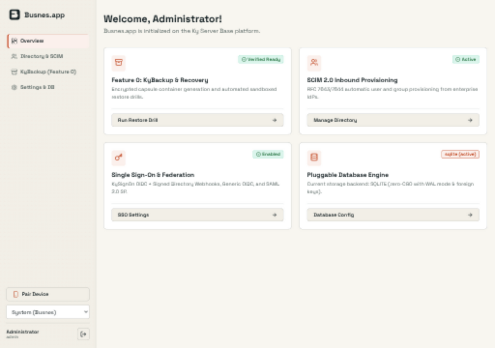
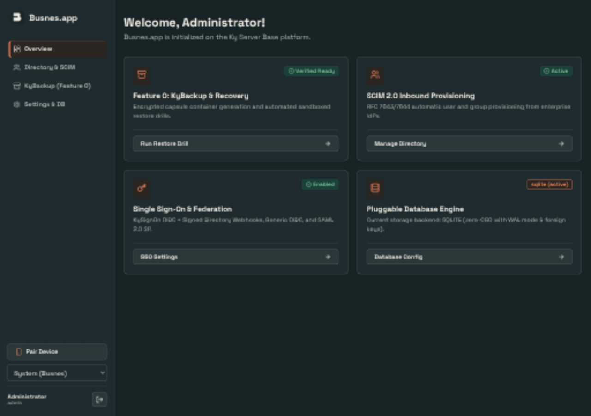
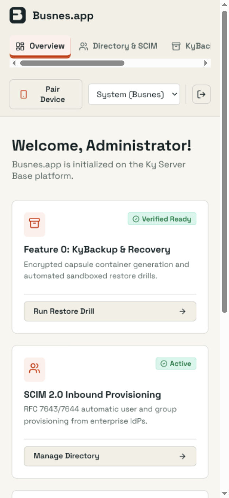
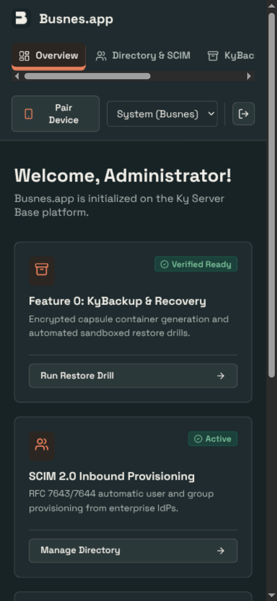
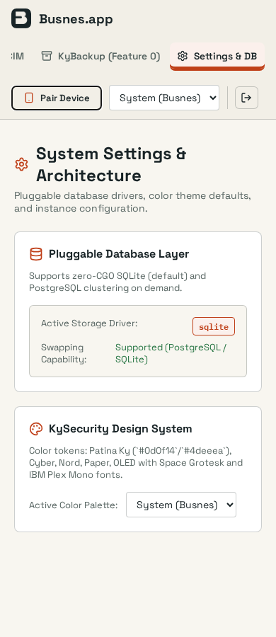
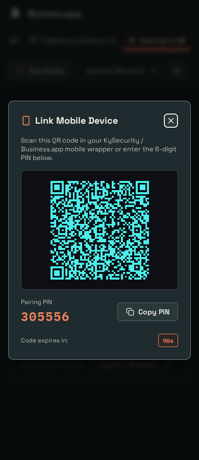

# Shared UI verification

## Change

Include the base as a required consumer so future products inherit verified shared assets. Shared assets are pinned to ky-ui 0.2.0 with content hashes. Product layouts, saved theme keys and named presets remain local.

## Capture conditions

Captured 2026-09-25 from this branch, using the application UI (not a design mockup). Overview in a real scratch server using scaffold defaults.

OS-following Busnes Light and Dark were captured at 1280×900 and 390×844 CSS pixels. Browser device scaling may make PNG dimensions larger. Document width stayed within the viewport in these captured states; local navigation/table scrolling is intentional. Screenshots show the selected-page accent, not a complete accessibility audit.

The subsequent browser-regression change moves worker registration into the JS bundle; production CSP is unchanged. Activation now passes against the real server. HTML refreshes online, and caching excludes dynamic/auth routes.

## Checks

7 frontend tests and production build passed. Central ky-ui sync --check verified all ten consumers. Screenshot coverage is Busnes Light/Dark; existing named choices are retained, but not every named palette/page combination was visually exercised.

## Screenshots

| Light | Dark |
| --- | --- |
|  |  |
|  |  |

## Reproduce

### Automated regression coverage

`web/browser/ui.spec.mjs` runs against a freshly built Go server with disposable SQLite data, real login and production CSP at 390×900 and 1280×900 in both OS themes. CI retains screenshots and failure traces for seven days and requires the browser job before publishing.

The assertions cover worker activation and stale-shell refresh, invalid-login errors, theme persistence and cross-tab/OS transitions, Paper-to-Busnes switching, selected navigation/focus, Settings overflow, and pairing dialog containment/Escape/focus return. The tests exposed and fixed the old 480px minimum Settings column and non-modal pairing behavior. These are workflow checks, not all-page E2E or full accessibility coverage.

Representative captures from the automated run (2026-09-25; scratch pairing codes expire and the server is deleted afterward):

| Mobile Settings — light | Mobile pairing — dark |
| --- | --- |
|  |  |

Build the frontend, then run `go build -o .browser/server ./cmd/server` from the repo root and `cd web && npx playwright install chromium && npm run test:browser`.

### Manual inspection

Run npm ci, npm test (where configured), and npm run build in web/, then start the product with isolated local preview data following its README. Use System theme, emulate OS light/dark, and inspect both viewport sizes. Do not point preview instances at production data. For KyVault, use a configured development KyIdentity or explicitly labeled read-only browser fixtures; never bypass backend authentication.
